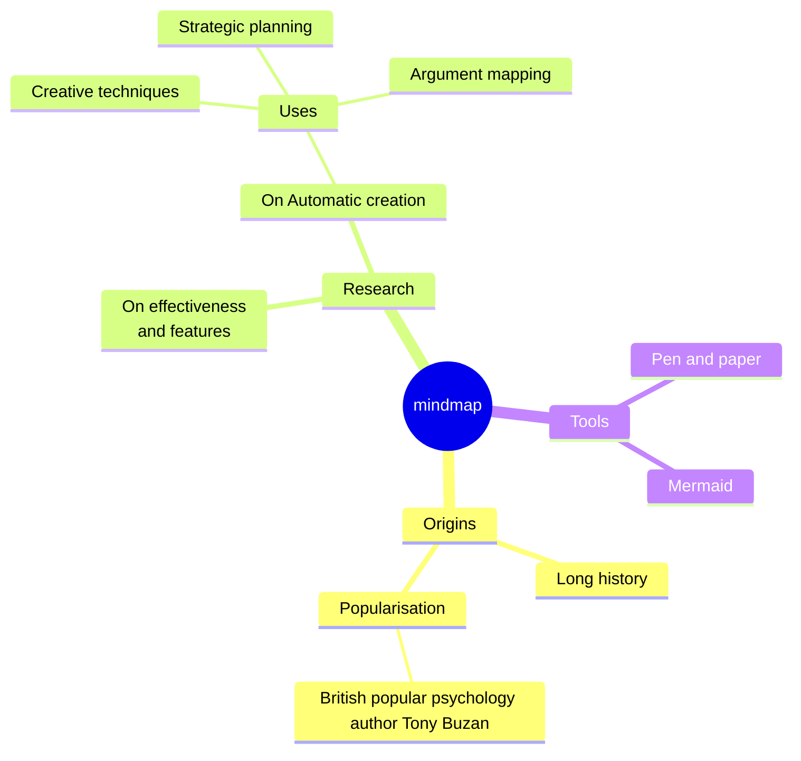

# Mermaid.js test/docs

## Usage

[Mermaid.js docs](https://mermaid.js.org/intro/)

```
```mermaid
code
...
```


```mermaid
  graph TD;
      A-->B;
      A-->C;
      B-->D;
      C-->D;
```


```mermaid
mindmap
  root((mindmap))
    Origins
      Long history
      ::icon(fa fa-book)
      Popularisation
        British popular psychology author Tony Buzan
    Research
      On effectiveness<br/>and features
      On Automatic creation
        Uses
            Creative techniques
            Strategic planning
            Argument mapping
    Tools
      Pen and paper
      Mermaid
```