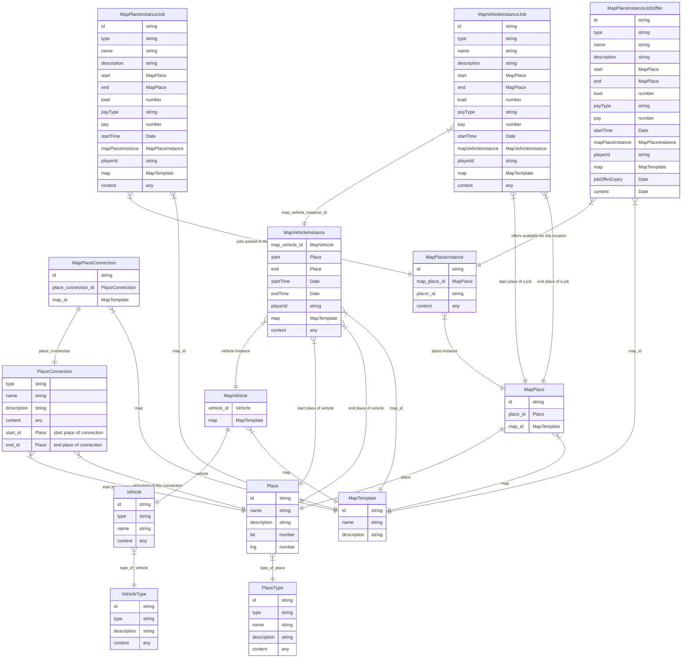

# Main entities diagram

```mermaid
erDiagram
  Place {
    id string
    name string
    description string
    lat number
    lng number
  }

  PlaceType {
    id string
    type string 
    name string
    description string
    content any
  }

  PlaceConnection {
    type string
    name string
    description string
    content any
    start_id Place "start place of connection"
    end_id Place "end place of connection"
  }

  MapTemplate {
    id string
    name string
    description string
  }

  MapPlace {
    id string
    place_id Place
    map_id MapTemplate
  }

  MapPlaceConnection {
    id string
    place_connection_id PlaceConnection
    map_id MapTemplate
  }

  MapPlaceInstance {
    id string
    map_place_id MapPlace
    placer_id string
    content any
  }

  MapPlaceInstanceJob {
    id string

    type string
    name string
    description string
    start MapPlace
    end MapPlace
    load number
    payType string
    pay number
    startTime Date

    mapPlaceInstance MapPlaceInstance
    playerId string
    map MapTemplate
    content any
  }

  MapPlaceInstanceJobOffer {
    id string

    type string
    name string
    description string
    start MapPlace
    end MapPlace
    load number
    payType string
    pay number
    startTime Date

    mapPlaceInstance MapPlaceInstance
    playerId string
    map MapTemplate
    jobOfferExpiry Date
    content Date
  }

  Vehicle {
    id string
    type string
    name string
    content any
  }

  VehicleType {
    id string
    type string
    description string
    content any
  }

  MapVehicle {
    vehicle_id Vehicle
    map MapTemplate
  }

  MapVehicleInstance {
    map_vehicle_id MapVehicle
    start Place
    end Place
    startTime Date
    endTime Date
    playerId string
    map MapTemplate
    content any
  }

  MapVehicleInstanceJob {
    id string

    type string
    name string
    description string
    start MapPlace
    end MapPlace
    load number
    payType string
    pay number
    startTime Date

    mapVehicleInstance MapVehicleInstance
    playerId string
    map MapTemplate
    content any
  }

  Place }|--|| PlaceType : type_of_place
  Vehicle }|--|| VehicleType : type_of_vehicle

  PlaceConnection }|--|| Place : "start place of this connection"
  PlaceConnection }|--|| Place : "end place of this connection"

  MapPlace ||--|| Place : place
  MapPlace }|--|| MapTemplate : map

  MapVehicle ||--|| Vehicle: vehicle
  MapVehicle }|--|| MapTemplate : map

  MapPlaceConnection ||--|| PlaceConnection : place_connection
  MapPlaceConnection }|--|| MapTemplate : map

  MapPlaceInstance }|--|| MapPlace : "place instance"

  MapVehicleInstance }|--|| MapVehicle : "vehicle instance"
  MapVehicleInstance }|--|| Place : "start place of vehicle"
  MapVehicleInstance }|--|| Place : "end place of vehicle"
  MapVehicleInstance }|--|| MapTemplate : map_id

  MapPlaceInstanceJob }|--|| MapPlaceInstance : "jobs parked in this location"
  MapPlaceInstanceJob }|--|| MapTemplate : map_id

  MapPlaceInstanceJobOffer }|--|| MapPlaceInstance : "offers available for this location"
  MapPlaceInstanceJobOffer }|--|| MapTemplate : map_id

  MapVehicleInstanceJob }|--|| MapVehicleInstance : map_vehicle_instance_id
  MapVehicleInstanceJob }|--|| MapPlace : "start place of a job"
  MapVehicleInstanceJob }|--|| MapPlace : "end place of a job"

```